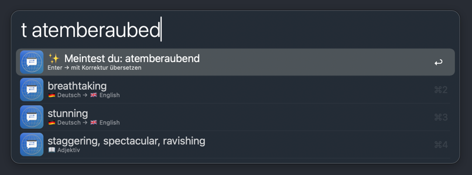

# Quick Translate — Alfred Workflow

## Usage

Translate text and copy the result to the clipboard via the `qtr` keyword.

**Examples:**

| Input | Result |
|-------|--------|
| `qtr how are you` | Wie geht es dir |
| `qtr Sehenswürdigkeiten` | Sightseeing attractions |
| `qtr bonjour le monde` | Hallo Welt |
| `qtr house` | Haus + dictionary (noun, verb, adjective) |

Text in your primary language is translated to your target language. Text in any other language comes back to your primary language. The workflow picks the direction automatically based on the detected language.

Press Enter to copy the result to the clipboard.

## Features

- Auto language detection for 130+ languages
- Dictionary entries for single words, grouped by part of speech
- Alternative translations for sentences
- Transliteration for non-Latin scripts (Japanese, Korean, Arabic, Hindi)
- Autocorrect catches typos and offers a correction before translating
- Two requests run in parallel, so response time stays short either way

## Workflow's Configuration

| Setting | Default | Description |
|---------|---------|-------------|
| Primary Language | Deutsch | Your native language |
| Target Language | English | Where your primary language is translated to |
| Keyword | `qtr` | Alfred keyword to start translating |

## Installation

Download `QuickTranslate.alfredworkflow` from [Releases](https://github.com/snazzybean/alfred-quick-translate/releases/latest) and double-click to import into Alfred.

## How it works

Two requests run in parallel, one for each possible direction. The workflow picks the matching result based on the detected language.

For single-word queries, Google Translate also returns dictionary data: word classes, synonyms, and alternative meanings. These appear below the main translation.

Uses Google Translate's unofficial `gtx` endpoint. No API key needed, but the endpoint is not officially supported and could change without warning.

## License

MIT, see [LICENSE](LICENSE).
